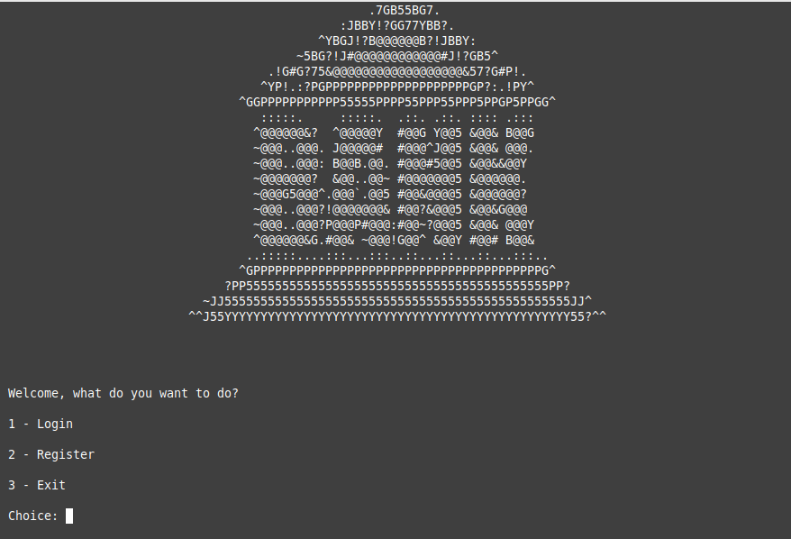
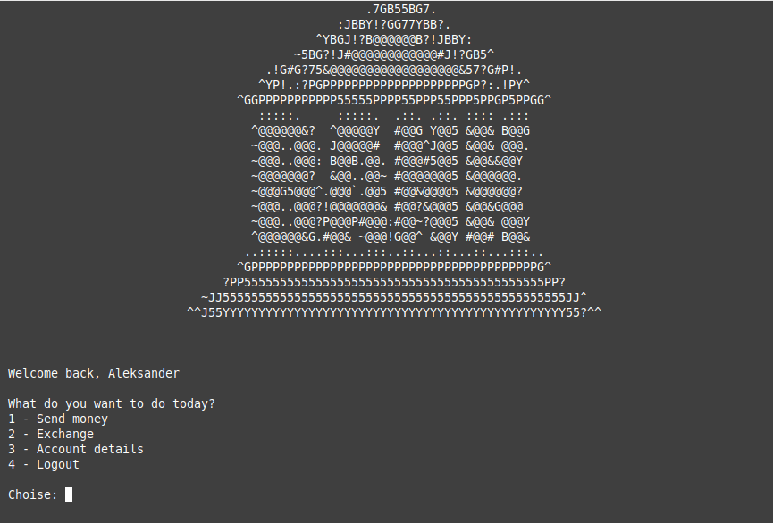
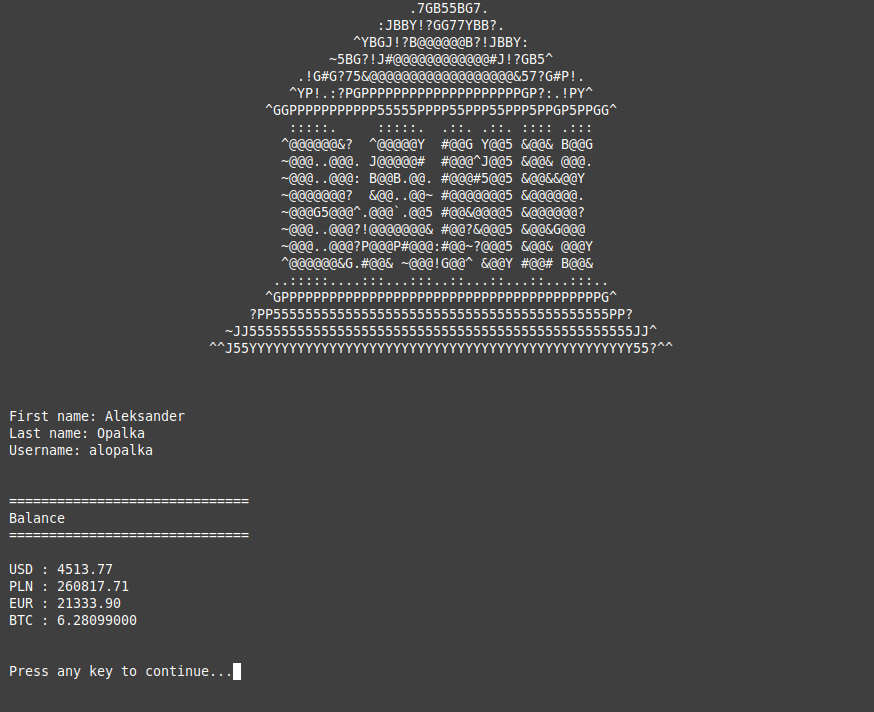
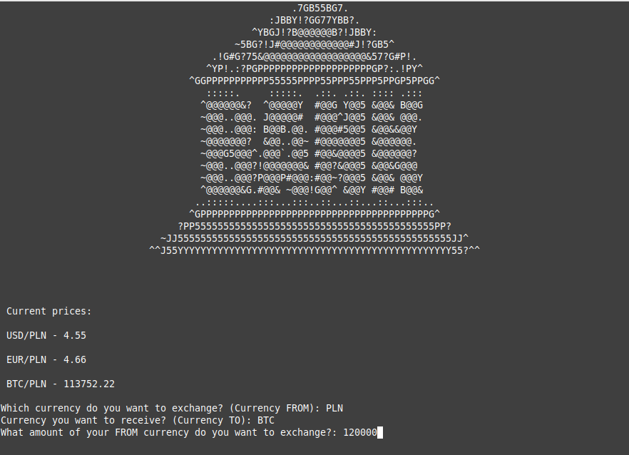

# Python_Banking_Simulator

### What is this project?

This project is a simple bank simulator written in Python language. Project mainly focuses on Classes and it's own methods. In order to make code more universal and bugs easier to fix.
Project don't have GUI. Everything happens in terminal window.

## Features

#### Sending money

- User can send money to other user
- User can choose which currency he wants to send

#### Exchanging money

- User can swap currencies
- To estimate values of currency pairs. Script makes API GET to ```api.exchangerate.host```
- There are 4 avalable currencies ( USD,BTC,PLN,EUR )
- Exchange is feeless

#### User details

- User can check his balance and his account details

#### Authorization

- Users can register, login and logout 

## Screenshots






